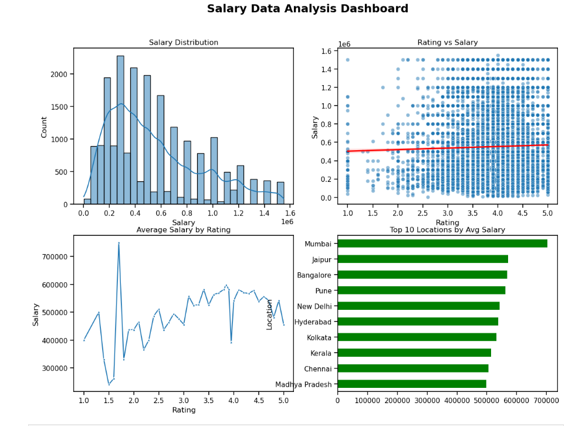

# Salary-Data-Analysis-using-Python

## Project Overview

This project performs exploratory data analysis (EDA) on a salary dataset to understand how salaries vary across **job roles, locations, and company ratings**. The main objective of this project is to practice data cleaning, analysis, and visualization using Python, while clearly explaining insights in simple language suitable for an internship or fresher-level role.

This project focuses on **understanding data**, not on machine learning or prediction.

---

## Problem Statement

Job seekers and companies often want to know how different factors such as job role, city, and company rating affect salaries. Using a real-world salary dataset, this project explores these factors and identifies key patterns in salary distribution.

---

## Scope of Work (SOW)

The scope of this project includes:

* Loading and understanding the salary dataset
* Cleaning the data by handling missing values and duplicates
* Removing salary outliers to avoid misleading results
* Performing exploratory data analysis (EDA)
* Creating visualizations to support findings
* Summarizing insights in a clear and simple manner

This project does **not** include machine learning or salary prediction.

---

## Dataset

* File: `Salary_Dataset_DSL.csv`
* Contains salary information along with job role, location, company rating, and employment details
* Dataset is used for learning and analysis purposes only

---

## Tools & Technologies Used

* Python
* Pandas
* NumPy
* Matplotlib
* Seaborn
* Jupyter Notebook

---

## Project Structure

## Dataset Preview
- 📄 [Click here to view the dataset](Salary_Dataset_DSL.csv)
The dataset opens directly on GitHub and allows quick preview of rows and columns.

## Dashboard Preview
Below is a summary dashboard created from the analysis:

---

## Key Analysis Performed

* Salary distribution analysis to understand overall pay range
* Identification and removal of outliers using IQR method
* Comparison of average salaries across job roles
* Analysis of salary variation across different cities
* Study of relationship between company rating and salary
* Identification of most common job roles

---

## Dashboard Insights

### Salary Distribution

Most salaries fall within the **low to mid range**, while very high salaries are relatively rare. This shows that average-paying roles are more common than high-paying ones.

### Company Rating vs Salary

The analysis shows **no strong relationship** between company rating and salary. High salaries are present even in average-rated companies, and some highly rated companies offer moderate salaries.

### Average Salary by Company Rating

Average salaries fluctuate across ratings but do not show a consistent upward trend. This confirms that company rating has only a **weak influence** on salary.

### Salary Variation Across Locations

Metro cities such as **Mumbai, Bangalore, and Pune** offer higher average salaries compared to other locations. Location plays an important role in salary differences.

---

## Key Takeaways

* Salary is more influenced by **job role and location** than company rating
* High company rating does not always mean higher salary
* Metro cities generally provide better salary opportunities

---

## What I Learned

* How to clean real-world datasets
* How to perform exploratory data analysis
* How to visualize data for better understanding
* How to explain data insights clearly and simply

---

## Author

Seema Kumari

Aspiring Data Analyst | Python & SQL Learner
